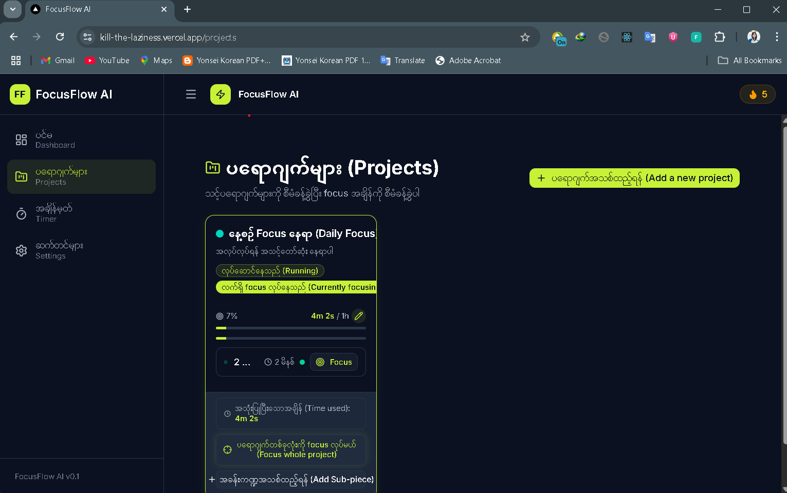
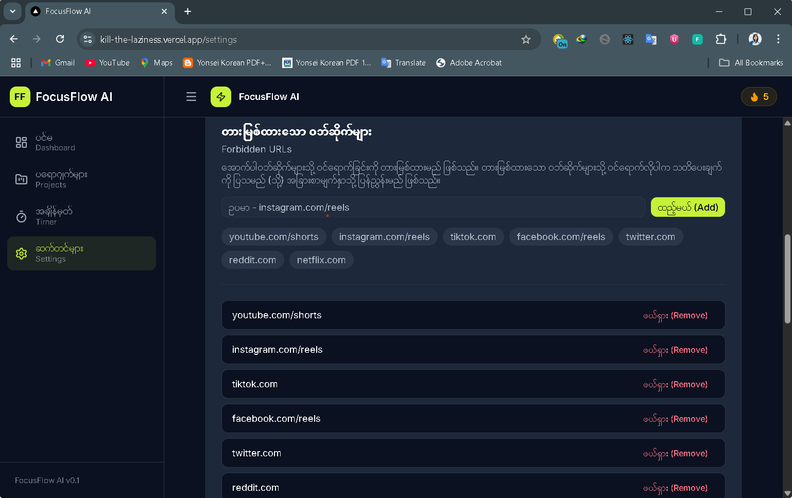
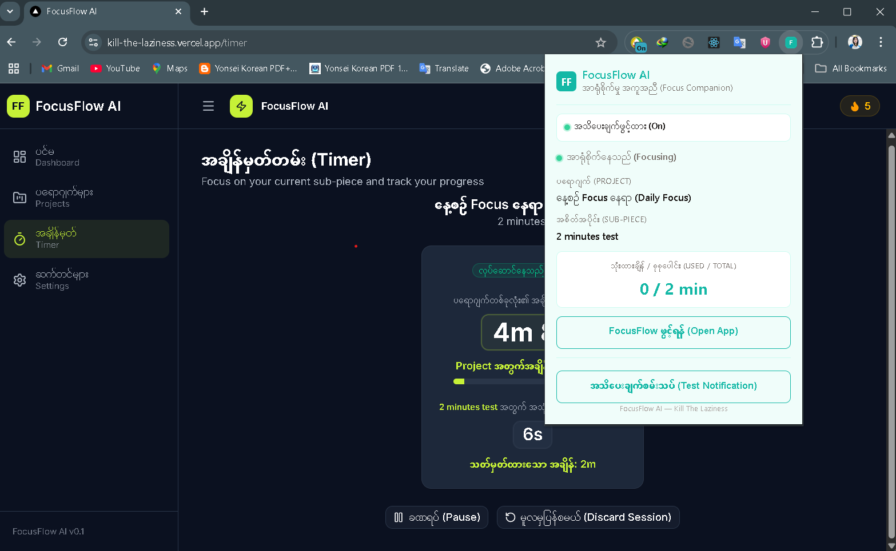
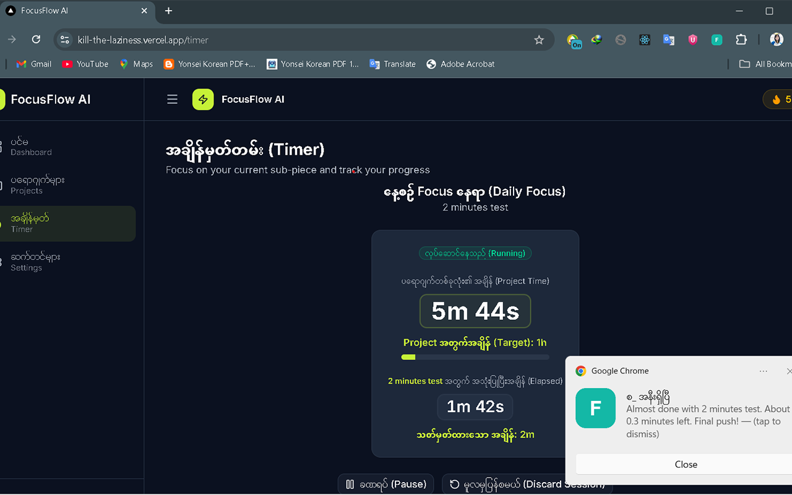

# FocusFlow AI / Kill The Laziness

> A gamified productivity dashboard + Manifest V3 browser extension built to help developers kill procrastination and reclaim deep-work time.

## Purpose

FocusFlow AI is designed for developers and heavy computer users who lose hours to short-form content and context switching. It combines a Next.js dashboard with a browser extension to:

- Break big goals into timed sub-tasks
- Track real focus time per project
- Block or warn on distracting sites
- Motivate through XP, streaks, levels, and a growing Dev-Fortress

For a full Burmese-language user guide, see [`docs/USER_GUIDE_MYANMAR.md`](docs/USER_GUIDE_MYANMAR.md).

---

## 🚀 Install FocusFlow AI Extension

> **Free download — no Chrome Web Store needed!**

### ⚡ Quick Install (30 seconds)

1. **Download** → [FocusFlow AI v0.1.0 (ZIP)](https://github.com/hlahtunthein09/kill_the_laziness/releases/tag/v0.1.0)
2. **Unzip** the downloaded file
3. Open **`chrome://extensions`** in your browser
4. Enable **Developer mode** (top-right toggle)
5. Click **Load unpacked** → select the unzipped folder
6. Open **https://kill-the-laziness.vercel.app/timer** and start focusing!

> 💡 **Tip:** Pin the extension to your toolbar for quick access to timer status.

---

## Core Features

- **Projects & Sub-pieces** — macro goals split into timed countdown tasks
- **Timer** — project timer counts up, sub-piece timer counts down, with drift-corrected accuracy
- **Dashboard** — focus stats, daily goal, streak, level, fortress visualization, quick focus
- **Browser Extension** — blocks/warns on forbidden sites and fires native OS notifications even when the tab is closed
- **Gamification** — XP per minute, completion bonus, streak counter, Dev-Fortress leveling
- **Settings** — strict/warn mode, forbidden URLs, notifications, sound, theme, daily goal, distraction log
- **Backup & Restore** — export/import store state as JSON
- **Scheduled Focus Sessions** — recurring focus reminders with browser notifications

## Screenshots

| Dashboard | Projects |
|---|---|
|  |  |

| Timer | Settings |
|---|---|
|  |  |

| Extension Popup | Extension Notification |
|---|---|
|  |  |

## Tech Stack

- **Framework:** Next.js 16 App Router, React 19, TypeScript 5
- **Styling:** Tailwind CSS 4, shadcn/ui
- **Animation:** Framer Motion, canvas-confetti
- **State:** Zustand 5 with persist middleware
- **Charts:** Recharts
- **Icons:** Lucide React
- **Extension:** WXT (Manifest V3), webextension-polyfill
- **Testing:** Vitest, React Testing Library, `@webext-core/fake-browser`, Playwright MCP
- **Package Manager:** npm

## Project Structure

```
kill_the_laziness/
├── app/                     # Next.js pages
├── components/              # UI components
│   ├── ui/                  # shadcn/ui primitives
│   ├── layout/              # AppShell, Sidebar, Header
│   ├── projects/            # Project/sub-piece UI
│   ├── timer/               # Timer components
│   ├── fortress/            # Dev-Fortress gamification
│   ├── distraction/         # Anti-distraction UI
│   ├── schedule/            # Scheduled focus sessions
│   └── analytics/           # Charts and stats
├── hooks/                   # Custom React hooks
├── lib/                     # Utilities, types, stores
├── extension/               # Browser extension (WXT)
├── .claude/                 # Claude Code context
│   ├── CLAUDE.md            # Project conventions
│   ├── memory/              # Project memory / resume points
│   ├── skills/              # Master skill files
│   └── agents/              # Agent definitions
└── slides/pitch.md          # Product pitch slides
```

## Workflows

This project is built piece-by-piece with user-confirmed scope:

1. **Read memory first** — `.claude/CLAUDE.md`, `.claude/memory/conventions.md`, `.claude/memory/progress.md`
2. **Research** — reuse findings from memory; query Context7/WebFetch only for new primitives
3. **Virtual sizing** — estimate files, hooks, pages, and lines before implementation
4. **Skill approval** — user approves the scope before a skill is written/updated
5. **Spawn agent + implement + tests** — every piece has tests; nothing is marked done until tests pass
6. **Verify** — `npx tsc --noEmit` + targeted vitest tests
7. **Update memory** — append status to `.claude/memory/progress.md`
8. **User review** — wait for approval before the next piece

See `.claude/skills/core-data-workflow-skill.md` for the full workflow convention.

## Claude Code Context

### MCP Servers

Configured in `.claude/mcp.json`:

- **context7** — library documentation lookup (Next.js, Zustand, Framer Motion, shadcn/ui, WXT, webextension-polyfill)
- **ctxai** — package safety validation and dependency context
- **github** — GitHub operations (branches, PRs, issues)
- **playwright** — browser automation for UI testing and live verification

### Skills

Five master skill files live in `.claude/skills/`:

1. **`frontend-layout-skill.md`** — app shell, navigation, dashboard, theme/dark mode
2. **`projects-timer-skill.md`** — project/sub-piece CRUD, timer engine, completion/refocus flows
3. **`extension-notifications-skill.md`** — WXT extension, background service worker, native notifications
4. **`settings-gamification-skill.md`** — settings, daily goal, streak, fortress, sync, schedules
5. **`core-data-workflow-skill.md`** — domain types, Zustand store, agent workflow rules

### Agents

Specialized agents in `.claude/agents/`:

- **core-architect** — data layer, state management, timer engine, sync protocol
- **ui-designer** — layout, shadcn/ui, Framer Motion animations, theme styling
- **extension-engineer** — Manifest V3 extension, service worker, content scripts, popup
- **notification-copywriter** — motivational Burmese-first notification and toast copy

## Development Scripts

```bash
npm install
npm run dev          # Start Next.js dev server
npm run build        # Build Next.js app
npm test             # Run full vitest suite
npx tsc --noEmit     # Type-check
npm run dev:ext      # Develop extension with WXT
npm run build:ext    # Build extension to .output/chrome-mv3
```

## Loading the Extension

> **This project includes a Manifest V3 browser extension.**
> The extension is required for anti-distraction blocking, native OS notifications, and off-screen timer sync.

### Option 1: Download from GitHub Release (Recommended)

1. Go to [Releases](https://github.com/hlahtunthein09/kill_the_laziness/releases/tag/v0.1.0)
2. Download `focusflow-extension.zip`
3. Unzip the file
4. Open `chrome://extensions` → Enable **Developer mode**
5. Click **Load unpacked** → select the unzipped folder
6. Open https://kill-the-laziness.vercel.app/timer

### Option 2: Build from Source

```bash
npm run build:ext
```

Then load `.output/chrome-mv3/` via `chrome://extensions` → **Load unpacked**.

### Updating after code changes

Download the latest release or rebuild from source, then click the **reload icon** (↻) on the extension in `chrome://extensions`.

### Web app origin

The extension connects to the deployed web app at:

- `https://kill-the-laziness.vercel.app/*`

No local server needed — it works entirely from the live deployment.

## UI Language

The interface is **Burmese-first** with English subtitles, following the project's design convention for Myanmar-speaking developers.

## License

*(Private repository — no license file present.)*
