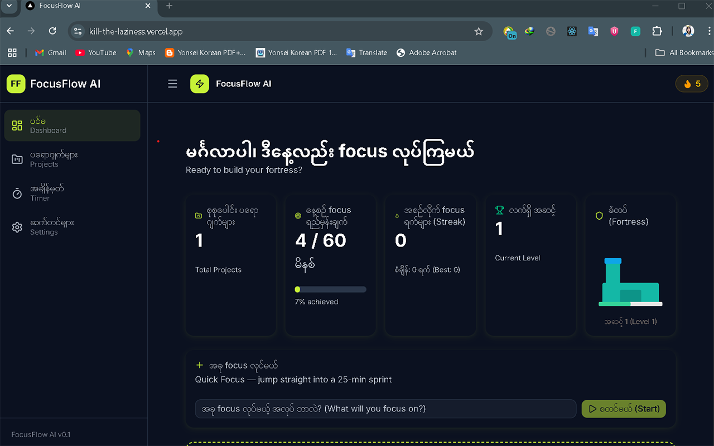
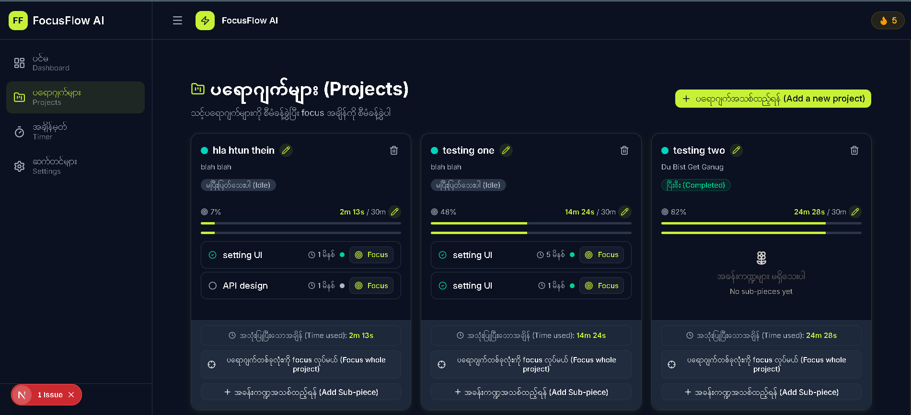
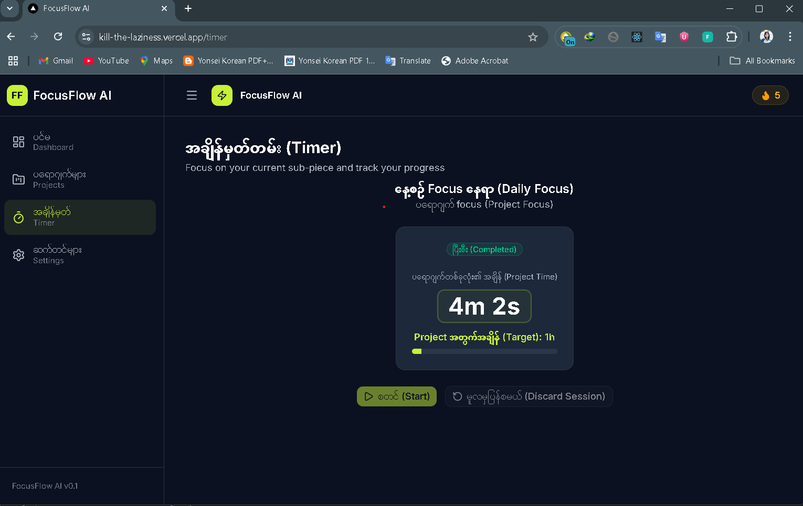
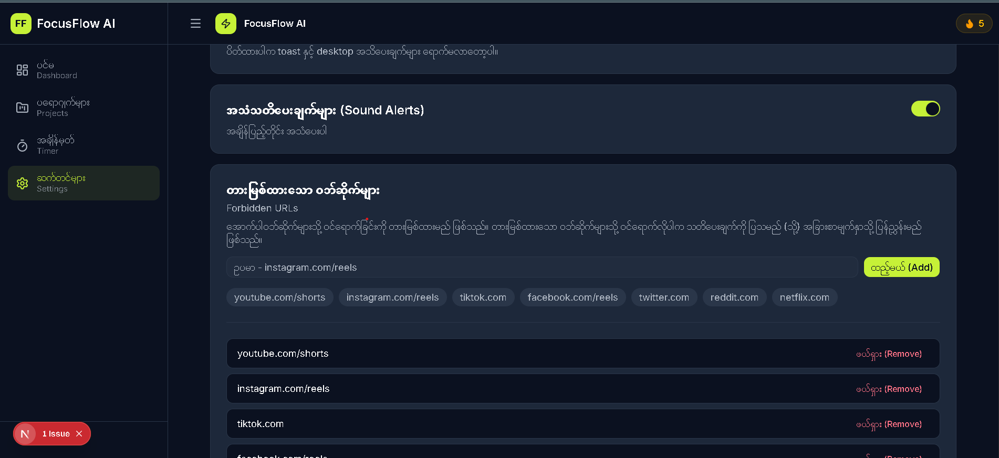
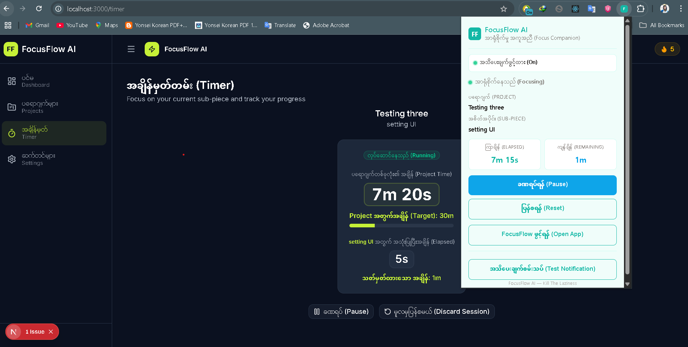

# FocusFlow AI / Kill The Laziness — Project Report

## Project

- **GitHub username:** @hlahtunthein09
- **Repo URL:** https://github.com/hlahtunthein09/kill_the_laziness
- **Live / download URL:** *(not deployed yet — runs locally via `npm run dev` / extension loaded from `.output/chrome-mv3/`)*
- **License:** *(private repository, no license file)*
- **One-line summary:** A gamified productivity dashboard + Manifest V3 browser extension that helps developers kill procrastination by blocking distracting sites, tracking focused time through projects and sub-pieces, and motivating with XP, streaks, and a growing dev-fortress.

## Product-Intro Slides

- **Slides path:** `slides/pitch.md`

## Methodology

Built using a piece-by-piece, user-confirmed workflow. Each feature (project/sub-piece CRUD, timer engine, browser extension, native notifications, dark mode, gamification, scheduled sessions) was researched, scoped, implemented with tests, and verified before moving to the next piece. The git workflow uses a feature branch (`feature/offscreen-notification-system`) with descriptive commits. Claude Code was used throughout for code generation, architecture decisions, UI/UX iteration, test writing, and memory management. The project evolved from a basic project timer into a full productivity ecosystem spanning a Next.js dashboard and a browser extension.

## Evidence — Claude Code usage

### MCP

**path:** `.claude/mcp.json`

**what:** Four MCP servers configured:
- **context7** — library documentation lookup (Next.js, Zustand, Framer Motion, shadcn/ui, WXT, webextension-polyfill).
- **ctxai** — package safety validation and dependency context (checks for hallucinated packages/methods).
- **github** — GitHub operations: branches, pull requests, issues.
- **playwright** — browser automation for UI testing and live verification via Playwright MCP.

### Skill

**path:** `.claude/skills/frontend-layout-skill.md`

**what:** Master skill for the Next.js app shell — AppShell, Sidebar, Header, dashboard, theme/dark-mode wiring, and global providers. Defines Burmese-first labels, nature pastel palette, hydration safety, and reusable page patterns.

**path:** `.claude/skills/projects-timer-skill.md`

**what:** Master skill for project/sub-piece CRUD, timer engine (`useTimer`), timer UI components (`TimerPanel`, `TimerDisplay`, `TimerControls`, `TimerToast`), and focus-session completion/refocus flows. Covers store actions, budget enforcement, drift correction, and extension bridge events.

**path:** `.claude/skills/extension-notifications-skill.md`

**what:** Master skill for the WXT Manifest V3 extension — background service worker, timer engine, native OS notifications, content scripts, popup UI, anti-distraction tab monitoring/redirect, and warn-mode overlay. Defines the off-screen notification architecture and permission-checked notification patterns.

**path:** `.claude/skills/settings-gamification-skill.md`

**what:** Master skill for settings page/toggles, daily focus goal, streak counter, XP/fortress gamification, distraction log, JSON import/export sync, and scheduled focus sessions. Covers motivation message tiers and notification copy conventions.

**path:** `.claude/skills/core-data-workflow-skill.md`

**what:** Master skill for domain types, Zustand store architecture, agent workflow rules, cross-cutting refactors, and generic coding conventions. Serves as the meta skill for maintaining consistency across the codebase.

### Agent

**path:** `.claude/agents/core-architect.md`

**what:** Owns the data layer, state management, timer engine, and sync protocol. Used to design `lib/types/index.ts`, `lib/store/*` slices, `hooks/useTimer.ts`, and the web/extension sync protocol.

**path:** `.claude/agents/ui-designer.md`

**what:** Builds the user interface — layout, shadcn/ui primitives, Framer Motion animations, project/timer presentational components, and theme styling. Ensures Burmese-first, accessible, pastel-nature design.

**path:** `.claude/agents/extension-engineer.md`

**what:** Builds the Manifest V3 browser extension for off-screen notifications and anti-distraction. Used for `extension/*`, service worker, content scripts, popup UI, and WXT build verification.

**path:** `.claude/agents/notification-copywriter.md`

**what:** Generates motivational notification messages and in-app encouragement text. Used to maintain Burmese-first, English-secondary, tiered motivational copy across `lib/motivation.ts` and `extension/lib/motivation.ts`.

## Tech Stack

- **Framework:** Next.js 16 App Router, React 19, TypeScript 5
- **Styling:** Tailwind CSS 4, shadcn/ui
- **Animation:** Framer Motion, canvas-confetti
- **State:** Zustand 5 with persist middleware
- **Charts:** Recharts
- **Icons:** Lucide React
- **Extension:** WXT (Manifest V3), webextension-polyfill
- **Testing:** Vitest, React Testing Library, `@webext-core/fake-browser`, Playwright MCP

## Key Features

- Project and sub-piece management with budget enforcement
- Accurate timer engine with drift correction and session restore
- Project-only or sub-piece focus modes
- Completion/refocus flows with motivational summaries
- Manifest V3 browser extension for off-screen timer ownership
- Native OS notifications for milestones, completion, schedules, and blocked distractions
- Anti-distraction strict/warn modes with site blocking and logging
- XP, streak, daily goal, and dev-fortress gamification
- Dark mode and pastel nature theme
- Scheduled focus sessions
- JSON backup/restore sync

## Screenshots

| Dashboard | Projects |
|---|---|
|  |  |

| Timer | Settings |
|---|---|
|  |  |

| Extension |
|---|
|  |
